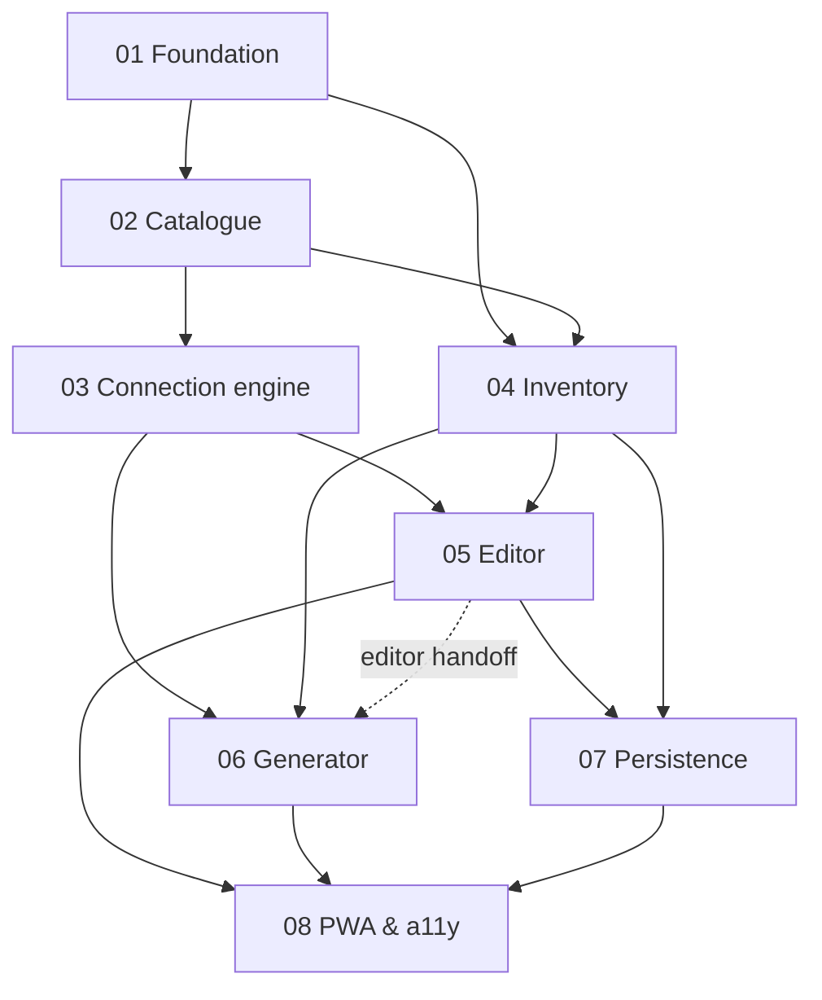

# Implementation Plans — Lego Train Layout Planner

Ordered implementation plans derived from
[`docs/prompts/planning.md`](../prompts/planning.md). Execute plans in sequence;
each plan lists explicit entry and exit criteria.

**Remote workflow:** [REMOTE-WORKFLOW.md](./REMOTE-WORKFLOW.md) — plans stay in
the repo; [GitHub issues](https://github.com/joshmcarthur/lego-train-layout-planner/issues)
track execution order and status.

## Plan sequence

| # | Plan | Summary | Depends on |
|---|------|---------|------------|
| 01 | [Project foundation](./01-project-foundation.md) | Repo scaffold, stack choice, module layout, CI, test harness | — |
| 02 | [Domain research & piece catalogue](./02-domain-research-and-piece-catalogue.md) | Lego geometry research, piece definitions, coordinate system | 01 |
| 03 | [Connection engine](./03-connection-engine.md) | Port alignment, adjacency, route graph, validation | 02 |
| 04 | [Inventory & onboarding](./04-inventory-and-onboarding.md) | Inventory entry, random mode, local persistence | 01, 02 |
| 05 | [Manual layout editor](./05-manual-layout-editor.md) | Grid canvas, placement, rotation, inventory panel | 03, 04 |
| 06 | [Layout generator](./06-layout-generator.md) | Candidate search, limits, results UX | 03, 04 (05 for “open in editor” handoff only) |
| 07 | [Persistence, sharing & layout lifecycle](./07-persistence-sharing-and-layout-lifecycle.md) | Save/load, URL codec, export, fork/extend | 04, 05 |
| 08 | [App shell, PWA & accessibility](./08-app-shell-pwa-and-accessibility.md) | Routing, offline, a11y, mobile posture | 04–07 |

Post-MVP (optional, not blocking MVP):

| # | Plan | Summary |
|---|------|---------|
| 09 | [Photo import feasibility](./09-photo-import-feasibility.md) | Semi-manual trace mode; phased CV assessment |

## Dependency graph

## ADRs

Architecture decisions are recorded in [`docs/adr/`](../adr/). Each plan calls out
when an ADR must be written before implementation proceeds. ADRs use the
template in [`docs/adr/template.md`](../adr/template.md).

## Pull request conventions (all plans)

- One PR per plan unless the plan explicitly splits work (e.g. foundation PR
  before feature PR).
- PR titles: `feat(scope): short description` matching the plan’s primary
  deliverable.
- PR body: **prose only, no markdown headings.** Describe what changed, why, and
  what reviewers should focus on. Include screenshot(s) for any visual/UI
  change. Test plans are not required.
- Commits within a PR should be atomic and semantic (`feat:`, `fix:`, `test:`,
  `chore:`, `docs:`). Squash only when merging if the branch history is noisy;
  prefer keeping logical commits during review.

## MVP success criteria (from planning prompt)

After plan **08** is complete, a user can:

1. Enter or randomize inventory
2. Generate at least one valid layout **or** manually build one
3. See clear feedback on invalid connections
4. Save locally and reload on return
5. Share a URL that restores layout for another user
6. Fork a shared layout into an editable copy

Domain logic (catalogue, connection engine, URL codec) must have automated
tests with known-good and known-bad fixtures.
