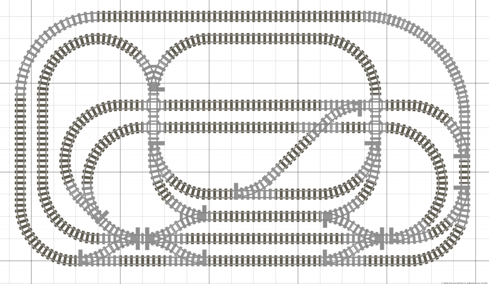

# Planning Prompt: Lego Train Layout Planner

You are a planning agent tasked with producing a detailed, actionable
implementation plan for a **Lego Train Layout Planner** — a browser-based
mini-app that helps users design valid train track layouts given a fixed
inventory of pieces.

This document is the **source of truth** for scope, constraints, and domain
requirements. Your output should be an implementation plan (architecture, data
models, milestones, test strategy, and technical decisions) — not code.

---

## Product Vision

Users own a finite set of Lego train track pieces (straights, curves,
switches/points, crossings, etc.) and want to explore which closed or open
routes are physically possible with that inventory. The app must understand how
pieces connect geometrically so that proposed layouts are **actually buildable**
— not merely visually plausible.

A reference layout (see attached design image) illustrates the target
experience: a top-down grid view where track segments snap to connection points,
switches branch correctly, and the overall topology forms coherent loops and
sidings.



---

## Target Users & Primary Jobs

1. **Inventory-first planning** — “I have X straights, Y curves, Z left-hand
   points — what can I build?”
2. **Exploration** — “Give me random inventory and show me interesting
   possibilities.”
3. **Manual design** — “Let me place pieces on a grid and see if my layout
   works.”
4. **Iteration** — “Start from an existing layout and extend or modify it.”
5. **Persistence & sharing** — “Save my layout locally and share a link with
   someone.”

---

## Functional Requirements

### Must Have (MVP)

#### 1. Onboarding — Piece Inventory Entry

- On first visit (or via settings), prompt the user to enter counts for each
  supported piece type.
- Supported piece types must include at minimum:
  - Straight tracks (by length if multiple standard lengths exist, e.g.
    short/medium/long)
  - Curved tracks (standard 45° or 90° radius segments as applicable to Lego
    train track)
  - Left-hand switch/point
  - Right-hand switch/point
  - Crossover / crossing (if part of standard Lego train track sets)
- Validate inputs (non-negative integers, reasonable upper bounds).
- Persist inventory in `localStorage`.
- Allow editing inventory at any time; warn if editing would invalidate an
  in-progress layout.

#### 2. Random Inventory Mode

- One-click “random inventory” for experimentation (configurable ranges or
  presets like “small set”, “medium set”, “large set”).
- Random inventory should still be editable before use.

#### 3. Piece Geometry & Connection Model (Critical)

This is the **core domain problem**. The plan must define:

- A **canonical catalogue** of Lego train track pieces with:
  - Footprint on a discrete grid (or sub-grid if needed for curves)
  - Connection points (ports) with position, orientation, and type (male/female
    or equivalent)
  - Allowed rotations (typically 0°, 90°, 180°, 270°)
  - Which port connects to which when two pieces are adjacent
- Rules for **valid adjacency**: two pieces connect only when ports align in
  position and facing direction.
- Rules for **route validity**:
  - A “route” is a connected graph of track segments.
  - Closed loops vs open terminuses (dead ends) should be distinguishable.
  - Switches introduce branching — define whether the app models a single chosen
    path through a switch or all possible paths.
- How curves change heading (e.g. 45° or 90° per segment) and how this affects
  grid placement.
- Whether the grid is **Lego stud-aligned** (common convention: straight = 16
  studs, curve radius = 4 stud units, etc.) — research and document the actual
  Lego track geometry conventions used.

**The implementation plan must not hand-wave this section.** Propose a concrete
representation (e.g. piece definitions as JSON schemas, port graphs, transform
matrices) and how connection validation works algorithmically.

#### 4. Layout Generation / Combination Explorer

- Given an inventory, generate and display **candidate layouts** that:
  - Respect piece counts (never exceed inventory)
  - Form geometrically valid connections
  - Optionally form closed loops
- Generation should account for **rotation** of pieces.
- UX: show multiple candidates (carousel, list, or grid of thumbnails); user can
  select one to inspect or edit.
- Define sensible limits (generation is combinatorially explosive) — e.g. cap
  results, timeout, heuristic search, or progressive generation.
- Clearly communicate when no valid layout exists for the given inventory.

#### 5. Manual Layout Editor

- Top-down **grid canvas** (as in reference image) where users can:
  - Place pieces from inventory onto the grid
  - Rotate pieces before/during placement
  - Remove or move pieces
  - See connection points and invalid placements highlighted
- **Inventory panel** showing remaining piece counts; decrement on place,
  increment on remove.
- Visual feedback:
  - Valid connection: ports align
  - Invalid: misaligned ports, overlapping footprints, or exhausted inventory
- Pan/zoom for larger layouts.
- Undo/redo is highly desirable for MVP if feasible.

#### 6. Save, Load & Share (No Backend)

- **Local persistence** via `localStorage`:
  - Inventory
  - One or more saved layouts (define schema/versioning)
- **URL serialization** for sharing:
  - Encode layout state (and optionally inventory) in a compressed, URL-safe
    string (e.g. base64 + LZ compression, or a purpose-built compact encoding).
  - Shared URL should restore full state on load.
  - Handle URL length limits gracefully (warn or fall back to local-only save).
- Export/import as JSON file is a reasonable addition.
- No authentication, no server-side storage.

#### 7. Start From Existing Layout

- “Duplicate and edit” — clone a saved or shared layout into the editor.
- “Extend” — append new pieces to an existing layout (inventory permitting).
- Loading a shared URL should support “fork this layout” (copy into editable
  session).

### Nice to Have (Post-MVP or Stretch)

#### 8. Photo / Image Import

- User uploads a photo of a physical layout.
- User marks a **reference point** on the image (or the app detects a known
  reference piece).
- App attempts to **extract piece placements** from the image.
- Plan should outline feasibility, likely approach (manual assist vs ML), and
  recommended phasing. Full computer vision is not required for MVP; a
  semi-manual “trace over photo” mode may be a pragmatic intermediate step.

---

## Non-Functional Requirements

| Area                | Requirement                                                                                                                |
| ------------------- | -------------------------------------------------------------------------------------------------------------------------- |
| **Platform**        | PWA-capable web app; works offline after first load                                                                        |
| **Backend**         | None — all state client-side                                                                                               |
| **Browser support** | Evergreen browsers only (latest Chrome, Firefox, Safari, Edge)                                                             |
| **Auth**            | Not required                                                                                                               |
| **Accessibility**   | Keyboard-navigable editor where practical; sufficient colour contrast                                                      |
| **Performance**     | Layout generation must not freeze UI — use Web Workers or chunked async if needed                                          |
| **Tests**           | Automated tests are **required** — especially for piece geometry, connection validation, and URL encode/decode round-trips |

---

## Architecture Preferences

The owner prefers:

1. **No backend** — `localStorage` + URL serialization for save/share.
2. **Modern web stack** with proper modularity. Preferred frameworks (in order
   of preference):
   - **Astro** (for app shell + islands)
   - **Lit** (for web components)
   - At minimum: **modular ES modules** with a build step (Vite, etc.)
3. **PWA over native iOS** — only consider native iOS if web tech cannot satisfy
   core geometry/editor requirements.
4. **Test framework** — Vitest, Playwright, or equivalent; unit tests for domain
   logic, integration/e2e for critical flows.

The plan should **recommend one stack** with rationale, not present an
exhaustive comparison.

---

## Suggested Module Boundaries

Propose a module structure along these lines (adjust as needed):

```
piece-catalogue/     # Piece definitions, ports, rotations, footprints
connection-engine/   # Validity checks, adjacency, graph building
layout-generator/    # Search/heuristics for candidate layouts
layout-editor/       # Canvas UI, placement, drag-drop, rotation
inventory/           # Onboarding, random mode, count tracking
persistence/         # localStorage, URL codec, export/import
app-shell/           # Routing, onboarding flow, PWA manifest
```

Domain logic (`piece-catalogue`, `connection-engine`, `layout-generator`,
`persistence`) must be **framework-agnostic** and heavily unit-tested. UI layers
should be thin.

---

## Key User Flows to Plan For

1. **First visit** → Enter inventory → See empty editor or “generate layouts”
   CTA
2. **Random play** → Random inventory → Generate candidates → Pick one → Edit
3. **Manual build** → Drag piece onto grid → Rotate → Connect → Save
4. **Share** → Copy URL → Recipient opens → Layout restored → Fork to edit
5. **Resume** → Return visit → Load from localStorage → Continue editing

Each flow should have acceptance criteria in the implementation plan.

---

## Domain Research Tasks

The planning agent should include research tasks for:

1. **Official Lego train track piece catalogue** — part numbers, dimensions,
   connection geometry (stud spacing, curve radii, switch branching angles).
2. **Existing tools** — Bricklink Studio, BlueBrick, TrackPlan, etc. — what can
   be learned or what formats might be compatible?
3. **Grid coordinate system** — choose a convention and stick to it (e.g.
   origin, unit = one stud, piece anchor point).
4. **Combinatorial complexity** — realistic scope for auto-generation with
   typical inventories (10–50 pieces).

Document findings and how they inform the data model.

---

## UI / UX Notes

- Reference image shows a **light grid background**, top-down track rendering
  with sleepers/rails, and clear junction blocks at connection points.
- Inventory panel (piece palette) alongside or below the canvas.
- Invalid states should be obvious (red highlight, tooltip explaining why).
- Mobile: view-only or simplified editor is acceptable for v1; desktop-first is
  fine if stated explicitly.

---

## Out of Scope (Unless Explicitly Expanded Later)

- Real-time multiplayer editing
- User accounts or cloud sync
- 3D rendering or Bricklink Studio export
- Train simulation / animation (optional visual polish only)
- Purchasing / linking to Lego shop inventory
- Support for non-standard or custom 3D-printed track

---

## Deliverables Expected from the Planning Agent

Produce an implementation plan document containing:

1. **Recommended tech stack** with justification
2. **Data models** — Piece, Port, Placement, Layout, Inventory, SerializedState
3. **Piece catalogue approach** — how pieces are defined and extensible
4. **Connection & validation algorithms** — pseudocode or flow diagrams
5. **Layout generation strategy** — algorithm choice, limits, UX for results
6. **Editor interaction model** — placement, rotation, snap behaviour
7. **Persistence & URL encoding scheme** — format, versioning, migration
8. **Milestone breakdown** — MVP vs post-MVP, with dependencies
9. **Test plan** — unit, integration, e2e coverage map
10. **Risks & open questions** — especially geometry accuracy and generation
    performance
11. **PWA setup** — manifest, service worker scope, offline behaviour
12. **Photo import feasibility** — honest assessment and phased approach

---

## Success Criteria

The MVP is successful when a user can:

1. Enter (or randomize) a piece inventory
2. Generate at least one valid layout OR manually build one on the grid
3. See clear feedback when connections are invalid
4. Save the layout locally and reload it on return
5. Share a URL that restores the layout for another user
6. Fork a shared layout into an editable copy

All connection/geometry logic must be covered by automated tests with known-good
and known-bad fixture layouts.

---

## Reference Material

- Design reference image: `assets/reference-layout.png` (complex multi-loop grid
  layout with straights, curves, switches, and crossings)
- Owner GitHub: `joshmcarthur` — repo will be public at
  `joshmcarthur/lego-train-layout-planner`

---

## Constraints Summary

- **No backend, no auth**
- **Client-only persistence** (`localStorage` + URL serialization)
- **Evergreen browsers, PWA target**
- **Framework: Astro, Lit, or modular JS** (planner must pick one)
- **Tests are mandatory** for domain logic
- **Piece connectivity is the hardest problem** — do not under-specify it

Begin planning.
